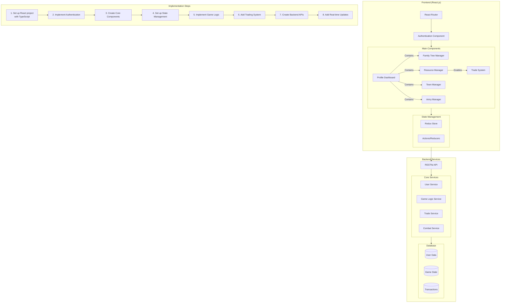

```mermaid
flowchart TB
    subgraph Frontend["Frontend (React.js)"]
        Router["React Router"]
        Auth["Authentication Component"]
        
        subgraph Components["Main Components"]
            Profile["Profile Dashboard"]
            FamilyTree["Family Tree Manager"]
            Resources["Resource Manager"]
            Towns["Town Manager"]
            Army["Army Manager"]
            Trade["Trade System"]
        end

        subgraph StateManagement["State Management"]
            Redux["Redux Store"]
            Actions["Actions/Reducers"]
        end
    end

    subgraph Backend["Backend Services"]
        API["RESTful API"]
        
        subgraph Services["Core Services"]
            UserService["User Service"]
            GameService["Game Logic Service"]
            TradeService["Trade Service"]
            CombatService["Combat Service"]
        end
        
        subgraph Database["Database"]
            Users[("User Data")]
            GameState[("Game State")]
            Transactions[("Transactions")]
        end
    end

    subgraph Implementation["Implementation Steps"]
        Step1["1. Set up React project<br/>with TypeScript"]
        Step2["2. Implement Authentication"]
        Step3["3. Create Core Components"]
        Step4["4. Set up State Management"]
        Step5["5. Implement Game Logic"]
        Step6["6. Add Trading System"]
        Step7["7. Create Backend APIs"]
        Step8["8. Add Real-time Updates"]
    end

    %% Frontend Connections
    Router --> Auth
    Auth --> Components
    Components --> StateManagement
    StateManagement --> API

    %% Backend Connections
    API --> Services
    Services --> Database

    %% Implementation Flow
    Step1 --> Step2
    Step2 --> Step3
    Step3 --> Step4
    Step4 --> Step5
    Step5 --> Step6
    Step6 --> Step7
    Step7 --> Step8

    %% Component Details
    Profile --> |Contains|FamilyTree
    Profile --> |Contains|Resources
    Profile --> |Contains|Towns
    Profile --> |Contains|Army
    Resources --> |Enables|Trade
```
